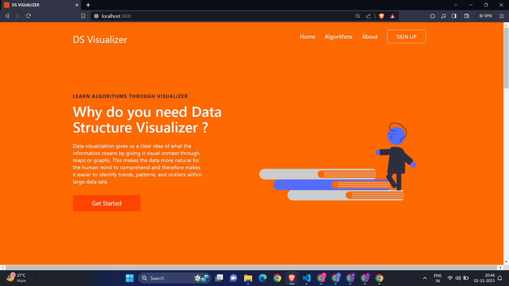
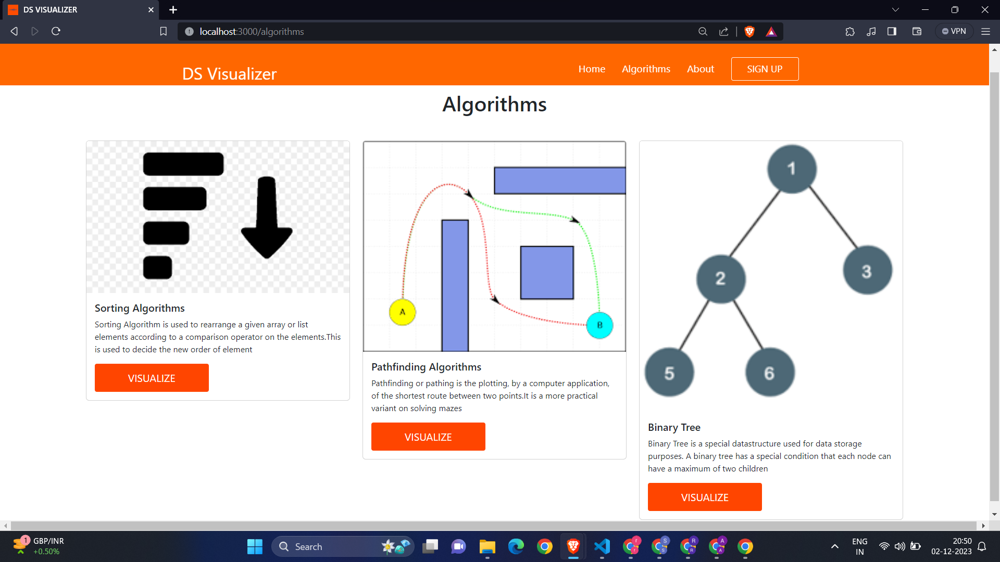
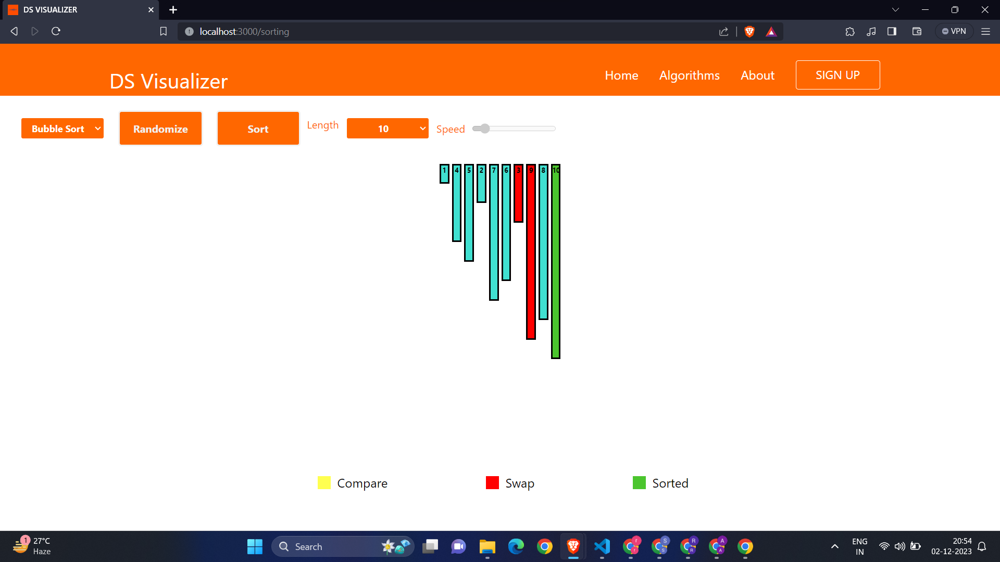
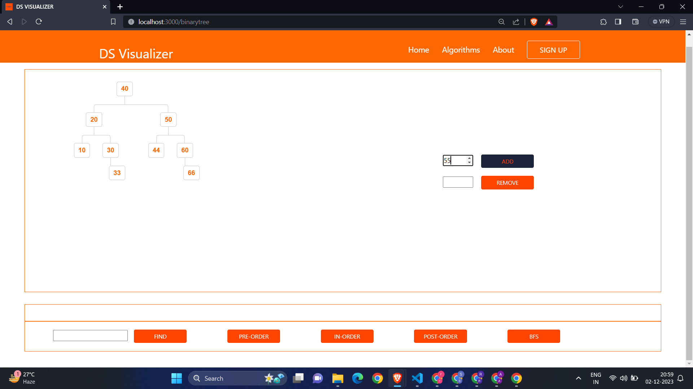
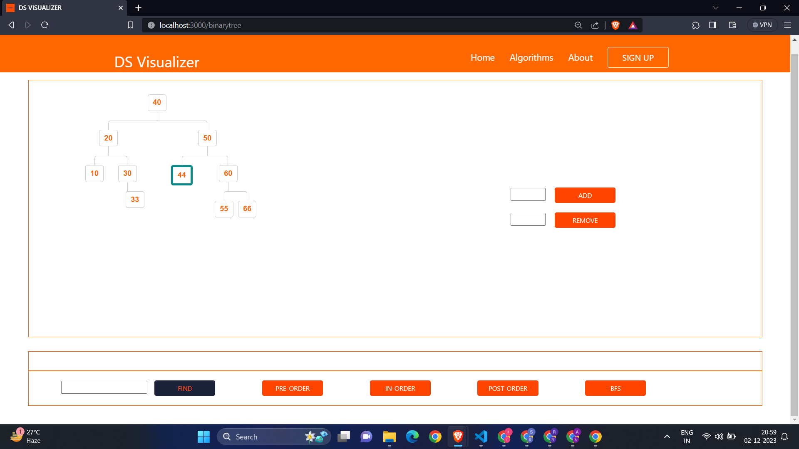
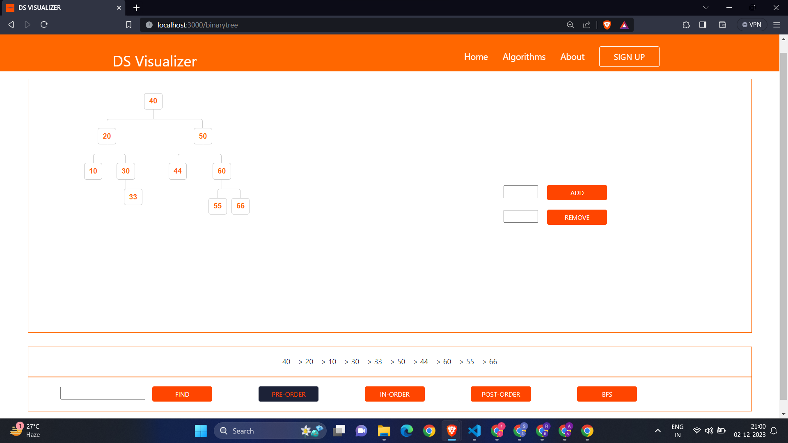

# Data Visualizer - Your Interactive Data Structure Visualizer

Data Visualizer is an engaging web application built with React.js, providing an immersive experience for visualizing various sorting algorithms and exploring binary tree operations. Whether you're a student learning about data structures or a developer looking to understand algorithms better, Data Visualizer is here to make the learning process both informative and enjoyable.

## Main Features:

### 1. Sorting Algorithms Visualization:
   - Visualize popular sorting algorithms, including Bubble Sort, Insertion Sort, Merge Sort, Quick Sort, and Selection Sort.
   - Step through each iteration or run the algorithms at different speeds to understand their behavior.

### 2. Binary Tree Visualization:
   - Explore the structure of binary trees with an interactive visualization.
   - Insert and delete nodes to see how the tree evolves dynamically.

### 3. Searching in Binary Tree:
   - Visualize the process of searching for an element in a binary tree.
   - Understand how the tree traversal algorithms work during the search operation.

### 4. Intuitive User Interface:
   - Immerse yourself in a clean and intuitive user interface designed for a seamless experience.
   - Effortlessly interact with the visualization controls and observe real-time updates.

### 5. Algorithm Speed Control:
   - Adjust the speed of algorithm execution to match your learning pace.
   - From slow-motion for in-depth understanding to fast-paced for a quick overview, control the visualization speed.

### 6. Responsive Design:
   - Access Data Visualizer seamlessly on various devices with a fully responsive design.
   - Enjoy the visualizations on desktops, tablets, and mobiles without compromising the user experience.

### 7. Educational Insights:
   - Gain insights into the inner workings of sorting algorithms and binary trees.
   - Learn through visualization and observe how data structures evolve with each step.

## Screenshots of the website:

### Created by
[Rohan Shirke](https://github.com/rohanshirke00)

Email : rohanshirke2k@gmail.com

### COPYRIGHT

Copyright 2021-22 © Logical Group Inc.
All rights reserved.